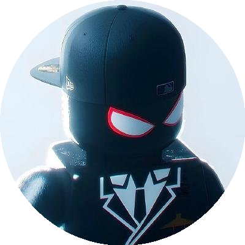

 

<h2>About Me</h2>

Hi! I'm João, a passionate Software Engineering student dedicated to building impactful solutions. I specialize in full-stack development and enjoy exploring emerging technologies in Artificial Intelligence and Cybersecurity.

I love turning ideas into real applications, solving complex problems, and continuously learning to stay ahead in the tech world. Whether it's coding a sleek web interface, scripting in Python, or diving into cybersecurity challenges, I thrive on creating practical and innovative solutions.

 

 

<h2 align="center">💻 Tech Stack<h2>

 

---

<h2 align="center">🌍 Languages</h2>

🇧🇷 Portuguese — Native  
🇺🇸 English — Intermediate

---

<h2 align="center">📬 Contact</h2>

---

<h2 align="center">🧠 Mindset</h2>

"People strive to change when the pain of change becomes greater than the pain of remaining as they are. 
Transform your pain into purpose."

---

<h2 align="center">🚀 Projects</h2>

All my projects are available below in my repositories 👇

---

