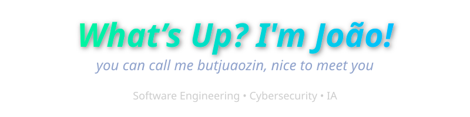
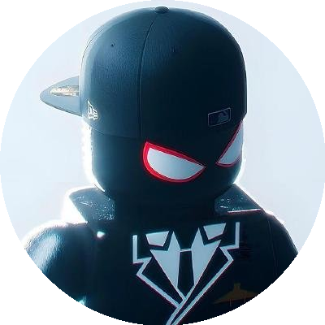

 

<h2>About Me</h2>

Hi! I'm João, a Software Engineering student passionate about building impactful and innovative solutions. I specialize in full-stack development and enjoy exploring technologies related to Artificial Intelligence, Cybersecurity, and modern software engineering practices.

I’m driven by problem-solving, continuous learning, and transforming ideas into practical applications. From developing responsive web interfaces and working with Python to exploring security challenges and scalable systems, I focus on creating efficient and meaningful solutions.

Beyond software development, I also have a strong interest in the gaming industry and game technologies, especially in areas involving interactive experiences, game systems, and emerging digital innovations. I’m always seeking opportunities to expand my skills and contribute to projects that combine creativity, technology, and real-world impact.

 

<h2 align="center">💻 Tech Stack<h2>

 

---

<h2 align="center">🌍 Languages</h2>

🇧🇷 Portuguese — Native  
🇺🇸 English — Intermediate

---

<h2 align="center">📬 Contact</h2>

---

<h2 align="center">🧠 Mindset</h2>

"People strive to change when the pain of change becomes greater than the pain of remaining as they are. 
Transform your pain into purpose."

---

<h2 align="center">🚀 Projects</h2>

All my projects are available below in my repositories 👇

---

